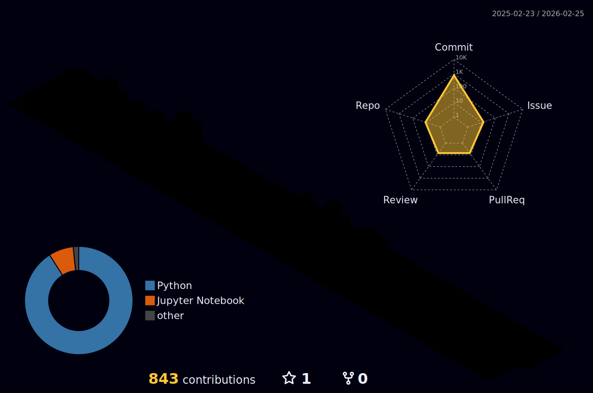

  <h1>
    
    
  </h1>
  
AI Researcher • Quantitative Researcher • NLP & LLM Engineer

  
  

    
    
    
    
    
  

---

Machine/Deep learning specialist focused on financial applications and NLP. Passionate about creating intelligent systems that combine cutting-edge ML methods with practical business value. Currently, I'm fascinated by the applicability of interpretability methods (XAI) and the transfer of NLP best practices (Transformers, LoRA) to financial analysis. I'm also actively developing my skills in Computer Vision and C++.

---

### 🎓 Education

| Institution | Program | Period |
|-------------|---------|--------|
| **ITMO (AI Talent Hub)** | Master's & PhD in Artificial Intelligence | 08.2025 - Present |
| **MIPT** | Specialist in Machine & Deep Learning Methods | 08.2024 - 07.2025 |
| **SPbU (GSOM)** | Bachelor's in Information Management | 08.2021 - 07.2025 |

---

### ⚙️ Tech Stack

| Category | Primary | Auxiliary |
|----------|---------|-----------------------|
| 🐍 **Languages** | Python | C++ • LaTeX • SQL |
| 🤖 **ML & DL** | PyTorch • cuML • XGBoost • CatBoost • Scikit-learn | Optuna • Ray Tune |
| 🔡 **LLM, NLP & Inference** | vLLM • llama.cpp • Transformers • LangChain • CrewAI • LoRA | Ollama • BERTopic • LangGraph |
| 💵 **Finance** | VectorBT • PandasTA • cctx | Time-series • Backtesting |
| 📂 **Data** | Pandas • Polars • Pydantic • PostgreSQL • Qdrant | Neo4j • ChromaDB |
| ⚒️ **Infra** | Pytest • Docker • Docker Compose • GitHub Actions • Linux • Yandex Cloud • AgentOps • Sphinx | LangFuse • UV • Ruff |
| 🕸 **Web** | FastAPI • AIOgram | Dash • Streamlit |
| 📊 **Data Visualization** | Seaborn • Plotly • DataMapPlot | Matplotlib |

---

### 🚀 Key Projects

#### **FinABYSS** - Next-gen Comprehensive Financial Analytics System (In Progress)
 
- News aggregation system achived SoTA financial clustering with 0.4 DBCV Index
- MoE architecture for publication sentiment analysis with multimodal asset price forecasting
- High-throughput parsing and processing of 1.5M+ financial news articles
- Optimized pipeline using GPU and Agent reduces training time by 40%, embedding extraction by 9 times, and topic modeling by 5 times.

#### **AutoFin** - Automated Financial Asset Forecasting System (In Progress)

- Micro-library for developing tree-based forecasting models
- Feature engineering pipeline (>23 indicators) and adaptive hyperparameter optimization
- The base system achieved a Sharpe ratio of 6.5 to 9.1 with a win rate of 52% to 63%, adaptability to market conditions and returns in bearish and flat markets from 18% to 21% on target cryptocurrencies on a 15-minute timeframe.

#### **ITMO Manager** - Multi-agent RAG System for Applicants

- System with specialized agents (orchestrator, analyst, advisor)
- Optimized inference for devices with 6GB VRAM
- Segmented memory and self-reflection mechanism

---

### 🏆 Achievements

- 🥇 1st Place • **Hackathon Winner (Yandex)** - Career planning and development system based on `vLLM`, `LangGraph`, and `Neo4j`
- 🥇 1st Place • **Financial Hackathon Winner (ALT3 Capital)** - `XGBoost`-based solution for price movement forecasting
- 🥇 1st Place • **FinTech Case Championship Winner (Alfa-Bank x VK Messenger)** - AI-agent based banking product proposal
- 📝 **Habr Publications** - Popular articles on mathematical statistics in ML
- 🤲 **Open-source Contributions** - PRs, code reviews, issues for `CrewAI`, `mem0ai`, `datamapplot`

There is my last publications on Habr:
<!-- BLOG-POST-LIST:START -->
- [Простыми словами о методе максимального правдоподобия и информации Фишера](https://habr.com/ru/articles/830326/?utm_campaign=830326&utm_source=habrahabr&utm_medium=rss)
- [Бутстрап и доверительные интервалы: от теории к практике на Python](https://habr.com/ru/articles/829336/?utm_campaign=829336&utm_source=habrahabr&utm_medium=rss)
<!-- BLOG-POST-LIST:END -->

---

### 📊 GitHub Stats

  
  

---

_Updated: October 2025*_
